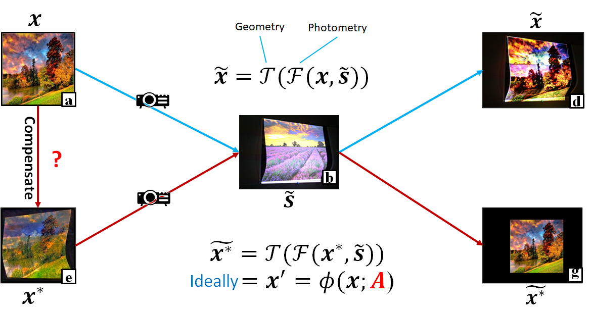
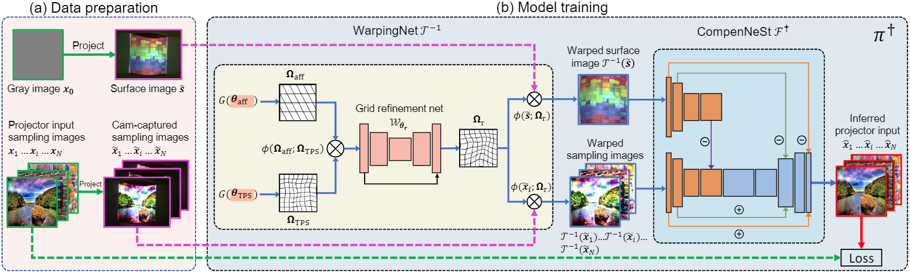
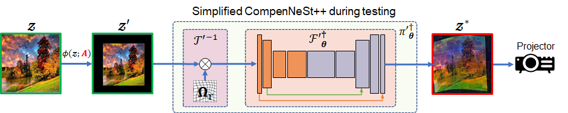
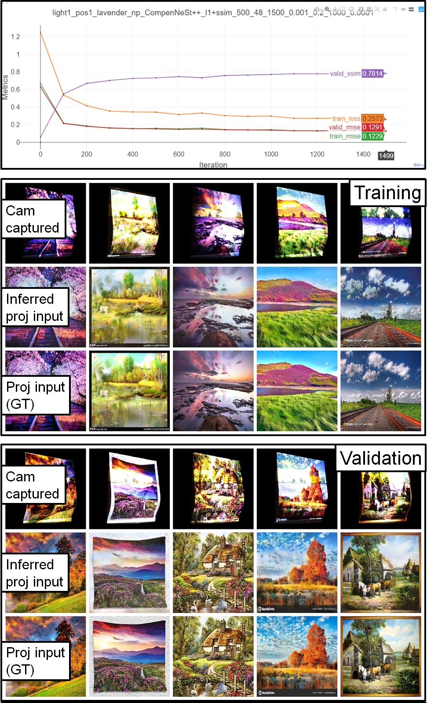

<!-- 
   -->

End-to-end Full Projector Compensation (PAMI)
  
===

## Introduction
PyTorch implementation of [CompenNeSt++ (PAMI)][1], a journal extension of [CompenNet (CVPR'19)][5] and [CompenNet++ (ICCV'19)][7]

Highlights:
*  The proposed **CompenNeSt++** is the **first end-to-end full** projector compensation system.
*  **CompenNeSt++** significantly outperforms [CompenNet++ (ICCV'19)][7] and has 27.7% less parameters. 
*  We propose a **pre-trained** CompenNeSt++ that can work with **only 8 images** and **3 min** training time (see **CompeNeSt++ pre** in the figure above).
*  We perform in-depth ablation studies and **show what features are learned by CompenNeSt++ and how the compensation is performed in the feature space**. Such studies were not available in our previous papers.
*  Compared with two-step methods, CompenNeSt++ not only is **fully differentiable** but also learns the geometric correction **without** an additional step of structured light and outperforms the traditional two-step methods (e.g., TPS w/ SL).
*  Two task-specific **weight initializations** and two **network simplification** techniques are proposed to further improve the convergence and running time efficiency of CompenNeSt++.
*  For the first time, a **synthetic data-based pre-training method** is proposed to significantly improve the practical efficiency of our system.
*  For the first time, a setup-independent **full compensation benchmark** and a **partial photometric compensation benchmark** are constructed.

For more info please refer to our [PAMI paper][1] and [supplementary material (~90M)][2]. 

---

## Learning-based formulation
We disentangle the **geometry** and **photometry** from the complex projector-camera light transport and model them as **WarpingNet** and **CompenNeSt**, respectively. Note that the blue and red paths share the same physical process, thus we can learn **CompenNeSt++** from the backward mapping \tilde{x} -> x (i.e., reverse blue path) instead of \tilde{x*} -> x* (i.e., reverse red path), obviating the need for the ground truth compensation image x*. See [CompenNeSt++][1] Sec. 3.1-3.2 and Fig. 3 for more details.

----

## Network architecture (training)

## CompenNeSt++ inferred projector input as training progresses

  

## Network architecture (testing)

  

----

## Prerequisites
* PyTorch compatible GPU
* Python 3
* PyTorch >= 1.2.0
* opencv-python 3.4.4
* visdom (for visualization)

## Benchmark dataset
* [Full compensation][3] (~11GB, 20 setups, same as [CompenNet++][7] dataset, but add `cam\warpSL\desire\test`)
* (optional) [Photometric compensation][8] (~4G, 24 setups, same as [CompenNet][5] dataset, images are geometrically registered)
* (optional) [Blender synthetic photometric compensation][9] (~40GB, 100 setups, we use it for CompenNeSt pre-training)

## Usage
### 

1. Clone this repo:
   
        git clone https://github.com/BingyaoHuang/CompenNeSt-plusplus
        cd CompenNeSt-plusplus

2. Install required packages by typing
   
        pip install -r requirements.txt
    

3. Download CompenNeSt++ [full compensation dataset][3] and extract to [`data/`](data)

4. Start **visdom** by typing

        visdom

5. Once visdom is successfully started, visit [`http://localhost:8097`](http://localhost:8097) (train locally) or `http://serverhost:8097` (train remotely).
6. Open [`train_compenNeSt++.py`](src/python/train_compenNeSt++.py) and set which GPUs to use. An example is shown below, we use GPU 0, 2 and 3 to train the model.
   
        os.environ['CUDA_VISIBLE_DEVICES'] = '0, 2, 3'
        device_ids = [0, 1, 2]

7. Run [`train_compenNeSt++.py`](src/python/train_compenNeSt++.py) to start training and testing

        cd src/python
        python train_compenNeSt++.py
8. The training and validation results are updated in the browser during training. An example is shown below, where the 1st figure shows the training and validation loss, rmse and ssim curves. The 2nd and 3rd montage figures are the training and validation pictures, respectively. In each montage figure, the **1st rows are the camera captured uncompensated images (\tilde{x}), the 2nd rows are CompenNeSt++ inferred projector input images (\hat{x}) and the 3rd rows are ground truth of projector input images (x)**. 
9. The quantitative comparison results will be saved to `log/%Y-%m-%d_%H_%M_%S.txt` after training.
   
<!--  -->
<!--  -->

  

----
## Apply CompenNeSt++ to your own setup

1. For a nonplanar textured projection surface, adjust the camera-projector such that the brightest projected input image (plain white `data/ref/img_0125.png`) slightly overexposes the camera captured image. Similarly, the darkest projected input image (plain black `data/ref/img_0001.png`) slightly underexposes the camera captured image. This allows the projector dynamic range to cover the full camera dynamic range. 
2. Create a setup data directory `data/light[n]/pos[m]/[surface]` (we refer it to `data_root`), where `[n]` and `[m]` are lighting and pose setup indices, respectively. `[surface]` is the projection surface's texture name.
3. Project and capture the plain black `data/ref/img_0001.png` and the plain white images `data/ref/img_0125.png` for projector FOV mask detection later. Then, save the captured images to `data_root/cam/raw/ref/img_0001.png(img_0125.png)`.
4. Project and capture a surface image `data/ref/img_gray.png`. Then, save the captured images to `data_root/cam/raw/ref/img_0126.png`.
5. Project and capture the training and validation images in `data/train` and `/data/test`. Then, save the captured images to  `data_root/cam/raw/train`,  `data_root/cam/raw/test`, respectively.
6. Find the optimal displayable area following the algorithm in `loadData` in [trainNetwork.py](src/python/trainNetwork.py). Then, affine transform the images in `data/test` to the optimal displayable area and save transformed images to `data_root/cam/raw/desire/test`. Refer to model testing below.
7. Update `data_list` in [`train_compenNeSt++.py`](src/python/train_compenNeSt++.py) (or [`train_pre-trained_compenNeSt++.py`](src/python/train_pre-trained_compenNeSt++.py) that only requires 8 training images) and run the script.
8. Project the compensated projector input images under `data_root/prj/cmp/test/[model]`.
   
Note other than `ref/img_0001.png`, `ref/img_0125.png` and `ref/img_gray.png`, the rest plain color  images are used by the original TPS w/ SL method, we don't need them to train CompenNeSt++. Similarly, `data_root/cam/raw/sl` and `data_root/cam/warpSL` are only used by two-step methods, e.g., [train_compenNeSt_with_SL.py](src/python/train_compenNeSt_with_SL.py).

----

## Citation
    @article{huang2020CompenNeSt++,
        title={End-to-end Full Projector Compensation},
        author={Bingyao Huang and Tao Sun and Haibin Ling},
        year={2021},
        journal={IEEE Transactions on Pattern Analysis and Machine Intelligence (TPAMI)} }

    @inproceedings{huang2019CompenNet++,
        author = {Huang, Bingyao and Ling, Haibin},
        title = {CompenNeSt++: End-to-end Full Projector Compensation},
        booktitle = {IEEE International Conference on Computer Vision (ICCV)},
        month = {October},
        year = {2019} }

    @inproceedings{huang2019compennet,
        author = {Huang, Bingyao and Ling, Haibin},
        title = {End-To-End Projector Photometric Compensation},
        booktitle = {IEEE Conference on Computer Vision and Pattern Recognition (CVPR)},
        month = {June},
        year = {2019} }

## Acknowledgments
The PyTorch implementation of SSIM loss is modified from [Po-Hsun-Su/pytorch-ssim](https://github.com/Po-Hsun-Su/pytorch-ssim).
The PyTorch implementation of TPS warping is modified from [cheind/py-thin-plate-spline](https://github.com/cheind/py-thin-plate-spline).
We thank the anonymous reviewers for valuable and inspiring comments and suggestions.
We thank the authors of the colorful textured sampling images. 

## License
This software is freely available for non-profit non-commercial use, and may be redistributed under the conditions in [license](LICENSE).

[1]: https://bingyaohuang.github.com/pub/CompenNeSt%2B%2B/
[2]: https://vision.cs.stonybrook.edu/~bingyao/pub/CompenNeSt_supp
[3]: https://bingyaohuang.github.com/pub/CompenNeSt++/full_cmp_data
[4]: https://www.mathworks.com/help/vision/ref/detectcheckerboardpoints.html
[5]: https://github.com/BingyaoHuang/CompenNet
[6]: https://github.com/BingyaoHuang/single-shot-pro-cam-calib/tree/ismar18
[7]: https://github.com/BingyaoHuang/CompenNet-plusplus
[8]: https://bingyaohuang.github.com/pub/CompenNeSt++/photometric_cmp_data
[9]: https://bingyaohuang.github.com/pub/CompenNeSt++/blender_data
